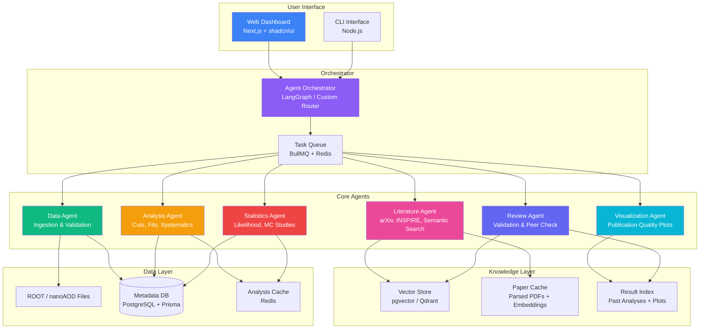

# CEPC Analysis Copilot with Literature Layer

> AI-powered multi-agent system for High Energy Physics (HEP) data analysis on the Circular Electron Positron Collider (CEPC), integrated with a real-time literature intelligence layer.

---

## Motivation

The **Circular Electron Positron Collider (CEPC)** is China's proposed next-generation particle collider, designed as a Higgs factory capable of producing millions of Higgs boson events with unprecedented precision. With recent government endorsements and accelerating engineering milestones, CEPC is moving from concept to concrete construction — and with it comes a massive analytical challenge.

High Energy Physics analysis is notoriously labor-intensive. A single physics result (e.g., a Higgs coupling measurement) can involve:

- **Terabytes** of simulated and real collision data in ROOT/nanoAOD format
- **Months** of iterative selection cuts, systematic uncertainty studies, and blind analyses
- **Hundreds** of relevant papers on arXiv, conference proceedings, and internal notes that must be tracked
- **Complex statistical frameworks** (frequentist profile likelihood, Bayesian approaches) requiring expert-level implementation

Existing tools — ROOT macros, Jupyter notebooks, CERN's SWAN service — are powerful but fundamentally **single-user, single-task** environments. No unified system bridges the gap between raw data analysis and live literature awareness. **CEPC Analysis Copilot** fills this gap.

---

## Architecture Overview



---

## 6-Phase Analysis Pipeline

### Phase 1 — Data Ingestion & Validation

The Data Agent takes raw ROOT files (EDM4HEP format, expected for CEPC) or nanoAOD-style flat trees, validates schema integrity, checks branch consistency, and loads metadata into PostgreSQL. It also computes basic data quality metrics (event counts, luminosity cross-checks, trigger efficiency summaries) and flags anomalies before any analysis begins.

### Phase 2 — Event Reconstruction & Feature Engineering

Using the Analysis Agent, the system applies detector-level corrections (momentum resolution smearing, energy calibration), reconstructs composite objects (jet clustering with CEPC-optimized algorithms, missing transverse energy, tau identification), and engineers physics features (invariant masses, angular observables, boosted decision tree inputs). This phase outputs analysis-ready datasets stored in Parquet for fast querying.

### Phase 3 — Selection, Cuts & Systematic Studies

The Analysis Agent iterates over physics-motivated selection criteria (kinematic cuts, isolation requirements, b-tagging working points). For each cut variation, it automatically evaluates signal efficiency, background rejection, and S/√B significance. The Literature Agent runs in parallel, searching for competing measurements and methodology papers to ensure the analysis strategy aligns with community best practices.

### Phase 4 — Statistical Analysis

The Statistics Agent constructs profile likelihood ratios following the HistFactory/combine convention, runs toy Monte Carlo studies for expected sensitivity, computes confidence intervals (CLs method, Feldman-Cousins where appropriate), and produces statistical summaries. It handles nuisance parameter correlations, systematic uncertainty breakdowns, and can execute both frequentist and Bayesian inference workflows.

### Phase 5 — Visualization & Plotting

The Visualization Agent generates publication-quality figures: stacked histograms with ratio panels, 2D efficiency maps, pull distributions, contour plots in the (mA, tanβ) plane, Feynman-diagram-style schematics, and comparison plots against published results. All plots follow CEPC/CERN collaboration plotting standards (ROOT style or Matplotlib with collaboration templates).

### Phase 6 — Literature Review, Validation & Report

The Review Agent cross-references final results against the Literature Agent's findings: it checks for consistency with existing measurements (LEP, LHC Run 2, ILD/SiD concepts), identifies potential overlooked systematics from recent papers, and generates a comprehensive analysis note draft. The Literature Layer provides live citation tracking — alerting the user if a new relevant paper appears on arXiv after the analysis is complete.

---

## The Literature Layer

The Literature Layer is not a separate tool — it is a **cross-cutting intelligence service** woven into every phase of the pipeline:

| Feature | Description |
|---------|-------------|
| **Live arXiv Monitoring** | Polls arXiv (hep-ex, hep-ph) daily for new submissions matching configurable keyword filters |
| **Semantic Search** | Embeds papers via a domain-adapted transformer and indexes them in a vector store for natural-language queries |
| **INSPIRE-HEP Integration** | Pulls citation graphs, author networks, and experimental results from INSPIRE for cross-referencing |
| **Automatic Summarization** | Generates structured summaries of relevant papers (methodology, key results, applicable systematics) |
| **Citation Alerting** | Triggers notifications when new papers cite or contradict the user's ongoing analysis |
| **Knowledge Graph** | Builds a relationship graph between measurements, methods, authors, and datasets over time |

---

## Tech Stack

| Layer | Technology | Rationale |
|-------|-----------|-----------|
| **Frontend** | Next.js 15, shadcn/ui, Tailwind CSS 4 | Modern React framework with excellent DX; shadcn for accessible, composable UI components |
| **Backend** | Next.js API Routes, BullMQ, Redis | Unified fullstack; BullMQ for reliable async job orchestration |
| **Database** | PostgreSQL, Prisma ORM | Relational metadata; Prisma for type-safe schema management |
| **Vector Store** | pgvector (or Qdrant) | Stores paper embeddings for semantic literature search |
| **Physics I/O** | uproot (Python), JSROOT | Read/write ROOT files; JSROOT for browser-native histogram rendering |
| **AI/LLM** | OpenAI GPT-4o / Claude, LangChain | Agent reasoning; LangChain for tool orchestration |
| **Orchestration** | LangGraph | Stateful multi-agent workflows with conditional routing |
| **Plotting** | Matplotlib, Plotly, ROOT (via Python) | Publication-quality figures; Plotly for interactive web plots |
| **Containerization** | Docker, Docker Compose | Reproducible environments for physics analyses |
| **CI/CD** | GitHub Actions | Automated testing, linting, and deployment |

---

## Repository Structure

```
cepc-analysis-copilot/
├── README.md
├── SKILLS.md
├── .env.example
├── .gitignore
├── docker-compose.yml
├── package.json
├── prisma/
│   └── schema.prisma
├── src/
│   ├── app/                    # Next.js App Router
│   │   ├── page.tsx
│   │   ├── analysis/
│   │   └── literature/
│   ├── components/              # UI components
│   ├── lib/
│   │   ├── agents/          # Agent implementations
│   │   ├── db/              # Prisma client
│   │   ├── pipeline/        # 6-phase pipeline orchestrator
│   │   └── literature/       # Literature Layer services
│   └── python/                  # Physics computation scripts
│       ├── io/              # ROOT file readers
│       ├── analysis/         # Cut flows, systematics
│       ├── statistics/       # Likelihood, MC toys
│       └── plotting/         # Publication figures
├── tests/
└── docs/
```

---

## Data Sources

| Source | Format | Description |
|--------|--------|-------------|
| CEPC Simulation Output | EDM4HEP / ROOT | Full detector simulation (Whizard + DD4hep + Geant4) |
| CEPC Reconstruction | ROOT Trees | Reconstructed physics objects (jets, leptons, photons, MET) |
| nanoAOD Derivatives | Parquet / ROOT | Flat n-tuple format for fast analysis |
| arXiv API | JSON / XML | Daily harvested paper metadata and full-text PDFs |
| INSPIRE-HEP API | JSON | Citation records, author profiles, experimental measurements |
| PDG (Particle Data Group) | JSON | Official particle properties, branching ratios, cross-sections |
| LHC Open Data | ROOT | Public LHC datasets for benchmarking and methodology transfer |

---

## Roadmap

### v0.1 — Foundation (Current)
- [x] Project specification and architecture design
- [x] Agent skill contracts (SKILLS.md)
- [ ] Repository scaffolding with Next.js + Prisma
- [ ] Basic Data Agent: ROOT file ingestion and schema validation

### v0.2 — Core Pipeline
- [ ] Analysis Agent: cut-flow automation and significance estimation
- [ ] Statistics Agent: profile likelihood construction
- [ ] Visualization Agent: standard HEP plot templates

### v0.3 — Literature Layer
- [ ] arXiv daily harvester with keyword filtering
- [ ] Semantic paper search via embeddings + pgvector
- [ ] INSPIRE-HEP integration for citation cross-referencing

### v0.4 — Intelligence & Orchestration
- [ ] LangGraph multi-agent orchestration
- [ ] Automatic literature-aware analysis recommendations
- [ ] Analysis note draft generation

### v0.5 — Collaboration & Deployment
- [ ] Multi-user support with role-based access
- [ ] Docker deployment for institutional HPC clusters
- [ ] CEPC collaboration onboarding guide

### v1.0 — Production
- [ ] Full 6-phase pipeline end-to-end
- [ ] Live citation alerting and knowledge graph
- [ ] Benchmarking against published CEPC pre-study results

---

## Why This Project Matters

With CEPC receiving renewed political and scientific momentum in China, the international HEP community is preparing for a data deluge unlike anything since the LHC. The analysis bottleneck is real: talented physicists spend disproportionate time on boilerplate data wrangling, literature tracking, and plot production rather than on the creative, interpretive work that drives discovery.

CEPC Analysis Copilot with a Literature Layer aims to:

1. **Democratize HEP analysis** — lower the barrier for junior researchers to perform world-class analyses
2. **Eliminate blind spots** — ensure no relevant paper or systematic is overlooked
3. **Accelerate discovery** — turn months of iterative analysis into days of guided, AI-assisted exploration
4. **Bridge communities** — provide a common platform connecting CEPC with LHC, ILC, and FCC-ee analysis methodologies

---

## License

Planned: MIT (open source) with a separate commercial license option for institutional deployments.

---

## Acknowledgements

Built with inspiration from the CEPC collaboration, the ROOT Data Analysis Framework, and the global HEP community's commitment to open science.
