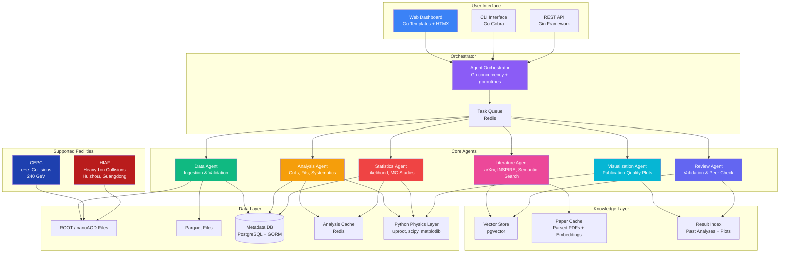

# China Particle Physics Analysis Copilot with Literature Layer

> AI-powered multi-agent system for High Energy Physics (HEP) and Nuclear Physics data analysis, supporting both the **Circular Electron Positron Collider (CEPC)** and the **High Intensity Heavy-ion Accelerator Facility (HIAF)**, integrated with a real-time literature intelligence layer.

---

## Breaking: China's HIAF Accelerator Goes Live (July 2026)

China has officially launched scientific operations at the **High Intensity Heavy-ion Accelerator Facility (HIAF)** in Huizhou, Guangdong province — a $384 million (2.6 billion yuan) science complex capable of producing the most intense atomic particle beams ever generated. This is a major inflection point for the project.

**Key facts from the [Interesting Engineering report](https://interestingengineering.com/science/china-kick-starts-heavy-ion-accelerator):**

- **Record-breaking beams**: HIAF delivers **8x as many atoms per pulse** as the previous record holder (GSI in Darmstadt, Germany), slashing data-gathering time for short-lived exotic atoms from months/years to hours/days.
- **Unique architecture**: The world's first heavy-ion research device that integrates a **100m superconducting linear accelerator**, a **570m main synchrotron ring**, and **integrated storage rings** into a single complex — boosting ions from ignition to ultra-high energies in one continuous system.
- **16 years in the making**: Joint effort by the Institute of Modern Physics (IMP) in Lanzhou and collaborating institutions; ground broken December 2018, first beam achieved October 2025.
- **Already producing results**: High-precision nuclear mass measurements, material radiation tests, rare isotope production, and advanced studies on highly charged ions.
- **Open to global collaborators**: Chinese state media confirmed the facility will be accessible to international scientific partners.
- **Chief engineer Yang Jiancheng**: _"These fast-moving ions act like microscopic bullets. By smashing them into target atomic nuclei, or into each other, scientists can recreate extreme conditions found only inside stars or during supernova explosions."_

**What this means for this project:** HIAF generates fundamentally different data from CEPC — heavy-ion collision data (nuclear physics) rather than electron-positron annihilation data (particle physics). The analysis workflows share many commonalities (ROOT files, cut flows, statistical inference) but differ in physics objects, observables, and reconstruction algorithms. This copilot now supports **both** experimental programs, making it the unified analysis platform for China's next-generation accelerator complex.

---

## Motivation

China is building a world-class accelerator ecosystem. Two flagship facilities anchor this vision:

1. **CEPC** — the Circular Electron Positron Collider, a proposed Higgs factory designed to produce millions of Higgs boson events with unprecedented precision at 240 GeV center-of-mass energy.

2. **HIAF** — the High Intensity Heavy-ion Accelerator Facility, now operational in Huizhou, producing the world's most intense heavy-ion beams for nuclear structure studies, exotic isotope research, and nuclear astrophysics.

Both facilities will generate petabytes of collision data in ROOT format, demand rigorous statistical analysis, and require constant awareness of the rapidly evolving literature landscape. A single physics result can involve:

- **Terabytes** of simulated and real collision data in ROOT/nanoAOD format
- **Months** of iterative selection cuts, systematic uncertainty studies, and blind analyses
- **Hundreds** of relevant papers on arXiv, conference proceedings, and internal notes that must be tracked
- **Complex statistical frameworks** (frequentist profile likelihood, Bayesian approaches) requiring expert-level implementation

Existing tools — ROOT macros, Jupyter notebooks, CERN's SWAN service — are powerful but fundamentally **single-user, single-task** environments. No unified system bridges the gap between raw data analysis and live literature awareness. **This copilot fills that gap** for China's accelerator program.

---

## Architecture Overview



---

## Supported Facilities

### CEPC — Circular Electron Positron Collider

| Attribute | Detail |
|-----------|--------|
| **Type** | e+e- circular collider (Higgs factory) |
| **Energy** | 240 GeV center-of-mass |
| **Status** | Pre-construction / design phase |
| **Key Physics** | Higgs couplings, electroweak precision, Z/WW/ZZ/ttbar |
| **Data Format** | EDM4HEP / ROOT |
| **Simulation** | Whizard + DD4hep + Geant4 |

### HIAF — High Intensity Heavy-ion Accelerator Facility

| Attribute | Detail |
|-----------|--------|
| **Type** | Heavy-ion synchrotron with storage rings |
| **Location** | Huizhou, Guangdong province, China |
| **Cost** | $384M (2.6B yuan) |
| **Status** | **Operational** (first beam Oct 2025, science ops Jul 2026) |
| **Key Physics** | Nuclear structure, exotic isotopes, nuclear astrophysics, material radiation testing |
| **Unique Feature** | 8x world-record beam intensity; integrated linac + synchrotron + storage rings |
| **Applications** | Cancer therapy (heavy-ion beams), rare isotope production, spacecraft alloy testing |
| **Lead Institute** | Institute of Modern Physics (IMP), Lanzhou |

---

## 6-Phase Analysis Pipeline

### Phase 1 — Data Ingestion & Validation

The Data Agent takes raw ROOT files (EDM4HEP format for CEPC, or HIAF-specific ROOT trees) or nanoAOD-style flat trees, validates schema integrity, checks branch consistency, and loads metadata into PostgreSQL. It auto-detects the originating facility (CEPC vs HIAF) from branch naming conventions and metadata headers. It also computes basic data quality metrics (event counts, beam luminosity or ion intensity cross-checks, trigger efficiency summaries) and flags anomalies before any analysis begins.

### Phase 2 — Event Reconstruction & Feature Engineering

Using the Analysis Agent, the system applies detector-level corrections appropriate to the facility. For CEPC: momentum resolution smearing, energy calibration, jet clustering. For HIAF: ion charge-state identification, time-of-flight corrections, magnetic rigidity calibration. It reconstructs composite objects and engineers physics features (invariant masses, angular observables, decay vertex positions). This phase outputs analysis-ready datasets stored in Parquet for fast querying.

### Phase 3 — Selection, Cuts & Systematic Studies

The Analysis Agent iterates over physics-motivated selection criteria (kinematic cuts, isolation requirements, particle ID criteria). For each cut variation, it automatically evaluates signal efficiency, background rejection, and S/√B significance. The Literature Agent runs in parallel, searching for competing measurements and methodology papers to ensure the analysis strategy aligns with community best practices.

### Phase 4 — Statistical Analysis

The Statistics Agent constructs profile likelihood ratios following the HistFactory/combine convention, runs toy Monte Carlo studies for expected sensitivity, computes confidence intervals (CLs method, Feldman-Cousins where appropriate), and produces statistical summaries. It handles nuisance parameter correlations, systematic uncertainty breakdowns, and can execute both frequentist and Bayesian inference workflows.

### Phase 5 — Visualization & Plotting

The Visualization Agent generates publication-quality figures: stacked histograms with ratio panels, 2D efficiency maps, pull distributions, contour plots, nuclear mass surface plots (HIAF), decay scheme diagrams, and comparison plots against published results. All plots follow collaboration plotting standards (ROOT style or Matplotlib with facility-specific templates).

### Phase 6 — Literature Review, Validation & Report

The Review Agent cross-references final results against the Literature Agent's findings: it checks for consistency with existing measurements (LEP, LHC Run 2, HIAF early results, ILD/SiD concepts), identifies potential overlooked systematics from recent papers, and generates a comprehensive analysis note draft. The Literature Layer provides live citation tracking — alerting the user if a new relevant paper appears on arXiv after the analysis is complete.

---

## The Literature Layer

The Literature Layer is a **cross-cutting intelligence service** woven into every phase of the pipeline:

| Feature | Description |
|---------|-------------|
| **Live arXiv Monitoring** | Polls arXiv (hep-ex, hep-ph, nucl-ex) daily for new submissions matching configurable keyword filters |
| **Semantic Search** | Embeds papers via a domain-adapted transformer and indexes them in a vector store for natural-language queries |
| **INSPIRE-HEP Integration** | Pulls citation graphs, author networks, and experimental results from INSPIRE for cross-referencing |
| **News Awareness** | Monitors major science outlets for facility milestones, funding announcements, and policy changes |
| **Automatic Summarization** | Generates structured summaries of relevant papers (methodology, key results, applicable systematics) |
| **Citation Alerting** | Triggers notifications when new papers cite or contradict the user's ongoing analysis |
| **Knowledge Graph** | Builds a relationship graph between measurements, methods, authors, datasets, and facilities over time |

---

## Tech Stack

| Layer | Technology | Rationale |
|-------|-----------|-----------|
| **Frontend** | Go html/template, HTMX, CSS | Server-rendered, no JS build step; HTMX for reactive interactions |
| **Backend** | Go (Gin framework) | High-performance, excellent concurrency for multi-agent orchestration |
| **Database** | PostgreSQL, GORM ORM | Relational metadata; GORM for type-safe Go schema management |
| **Vector Store** | pgvector | Stores paper embeddings for semantic literature search |
| **Cache/Queue** | Redis | Caching, rate limiting, and future async job queueing |
| **Physics I/O** | uproot (Python) | Read/write ROOT files with native Python access |
| **AI/LLM** | OpenAI GPT-4o | Agent reasoning, paper summarization, embedding generation |
| **Plotting** | Matplotlib, Plotly (Python) | Publication-quality figures; Plotly for interactive web plots |
| **Containerization** | Docker, Docker Compose | Reproducible environments for physics analyses |
| **Deployment** | Railway / Docker | One-click deploy to cloud with PostgreSQL and Redis |

---

## Repository Structure

```
cepc-analysis-copilot/
├── README.md
├── SKILLS.md
├── .env.example
├── .gitignore
├── Dockerfile
├── docker-compose.yml
├── Makefile
├── railway.json
├── go.mod
├── cmd/
│   └── server/
│       └── main.go                  # Application entry point
├── internal/
│   ├── agents/
│   │   ├── agent.go                  # Agent interface + types
│   │   ├── orchestrator.go           # 6-phase pipeline orchestrator
│   │   ├── data_agent.go             # Phase 1: Data Ingestion
│   │   ├── analysis_agent.go         # Phase 2-3: Cuts & Systematics
│   │   ├── literature_agent.go       # Cross-cutting: Literature Layer
│   │   ├── statistics_agent.go       # Phase 4: Statistical Analysis
│   │   ├── visualization_agent.go    # Phase 5: Plotting
│   │   └── review_agent.go           # Phase 6: Validation
│   ├── api/
│   │   ├── router.go                 # Gin router with all routes
│   │   ├── handlers/
│   │   │   └── handlers.go           # HTTP handlers
│   │   └── middleware/
│   │       ├── cors.go              # CORS configuration
│   │       └── logger.go            # Structured request logging
│   ├── config/
│   │   └── config.go                # Environment configuration
│   ├── db/
│   │   └── postgres.go              # PostgreSQL connection + migrations
│   ├── literature/
│   │   ├── arxiv.go                 # arXiv API client
│   │   ├── inspire.go               # INSPIRE-HEP API client
│   │   └── embedder.go              # OpenAI embedding generation
│   └── models/
│       └── dataset.go               # All data models
├── python/
│   ├── requirements.txt
│   ├── io/
│   │   └── root_reader.py           # ROOT file I/O via uproot
│   ├── analysis/
│   │   ├── cuts.py                  # Cut flow engine
│   │   └── quality.py               # Data quality checks
│   ├── statistics/
│   │   └── likelihood.py            # Profile likelihood + toy MC
│   └── plotting/
│       └── hep_plots.py             # Publication-quality HEP plots
├── pkg/
│   └── utils/
│       └── helpers.go               # Utility functions
├── web/
│   ├── templates/
│   │   ├── index.html               # Dashboard
│   │   ├── analysis.html            # Analysis management
│   │   └── literature.html          # Literature search
│   └── static/
│       └── css/
│           └── style.css             # Design system
└── .github/
    └── workflows/
        └── deploy.yml               # Railway CI/CD
```

---

## Data Sources

| Source | Format | Description |
|--------|--------|-------------|
| CEPC Simulation Output | EDM4HEP / ROOT | Full detector simulation (Whizard + DD4hep + Geant4) |
| CEPC Reconstruction | ROOT Trees | Reconstructed physics objects (jets, leptons, photons, MET) |
| HIAF Collision Data | ROOT Trees | Heavy-ion collision events, nuclear mass measurements, reaction products |
| HIAF Storage Ring Data | ROOT Trees | Long-lived isotope decay data, precision spectroscopy |
| nanoAOD Derivatives | Parquet / ROOT | Flat n-tuple format for fast analysis |
| arXiv API | JSON / XML | Daily harvested paper metadata and full-text PDFs |
| INSPIRE-HEP API | JSON | Citation records, author profiles, experimental measurements |
| PDG (Particle Data Group) | JSON | Official particle properties, branching ratios, cross-sections |
| AME (Atomic Mass Evaluation) | JSON | Nuclear mass data, decay properties (for HIAF analyses) |
| LHC Open Data | ROOT | Public LHC datasets for benchmarking and methodology transfer |

---

## Roadmap

### v0.1 — Foundation (Current)
- [x] Project specification and architecture design
- [x] Agent skill contracts (SKILLS.md)
- [x] Repository scaffolding with Go + Python
- [x] Basic Data Agent: ROOT file ingestion and schema validation
- [x] Literature Agent: arXiv + INSPIRE-HEP search
- [x] Web dashboard with HTMX
- [x] Docker + Railway deployment config

### v0.2 — Core Pipeline
- [ ] Analysis Agent: cut-flow automation and significance estimation
- [ ] Statistics Agent: profile likelihood construction
- [ ] Visualization Agent: standard HEP plot templates
- [ ] HIAF-specific analysis presets (nuclear mass, reaction cross-sections)

### v0.3 — Literature Layer
- [ ] arXiv daily harvester with keyword filtering (including nucl-ex for HIAF)
- [ ] Semantic paper search via embeddings + pgvector
- [ ] INSPIRE-HEP integration for citation cross-referencing
- [ ] News monitoring for facility milestones and funding updates

### v0.4 — Intelligence & Orchestration
- [ ] Multi-agent orchestration with goroutine concurrency
- [ ] Automatic literature-aware analysis recommendations
- [ ] Analysis note draft generation (LaTeX)
- [ ] Facility auto-detection from data metadata

### v0.5 — Collaboration & Deployment
- [ ] Multi-user support with role-based access
- [ ] Docker deployment for institutional HPC clusters
- [ ] CEPC and HIAF collaboration onboarding guides
- [ ] International collaborator access (per HIAF's open science policy)

### v1.0 — Production
- [ ] Full 6-phase pipeline end-to-end for both CEPC and HIAF
- [ ] Live citation alerting and knowledge graph
- [ ] Benchmarking against published CEPC pre-study results and HIAF early results
- [ ] Heavy-ion specific: nuclear mass surface analysis, decay chain reconstruction

---

## Why This Project Matters

With China's accelerator program rapidly maturing — HIAF now operational and CEPC advancing toward construction — the international physics community is preparing for a data deluge. HIAF's record-breaking beam intensity (8x the previous world record) means experiments that once took months can now be completed in hours, dramatically increasing the volume and velocity of data analysis demand.

This copilot aims to:

1. **Serve both flagship facilities** — unify CEPC (particle physics) and HIAF (nuclear physics) analysis under one platform
2. **Democratize physics analysis** — lower the barrier for junior researchers to perform world-class analyses
3. **Eliminate blind spots** — ensure no relevant paper, systematic, or facility milestone is overlooked
4. **Accelerate discovery** — turn months of iterative analysis into days of guided, AI-assisted exploration
5. **Bridge communities** — connect CEPC, HIAF, LHC, ILC, and FCC-ee analysis methodologies
6. **Support HIAF's open science mission** — provide tools accessible to the global collaborators China has invited

---

## License

Planned: MIT (open source) with a separate commercial license option for institutional deployments.

---

## Acknowledgements

Built with inspiration from the CEPC and HIAF collaborations, the ROOT Data Analysis Framework, the Institute of Modern Physics (IMP) in Lanzhou, and the global physics community's commitment to open science.

---

## References

- [China fires up giant accelerator capable of producing world-record atomic beams](https://interestingengineering.com/science/china-kick-starts-heavy-ion-accelerator) — Interesting Engineering, July 2026
- [CEPC Pre-CDR](https://cepc.ihep.ac.cn/) — Institute of High Energy Physics, CAS
- [HIAF Project Page](https://www.imp.cas.cn/) — Institute of Modern Physics, CAS
