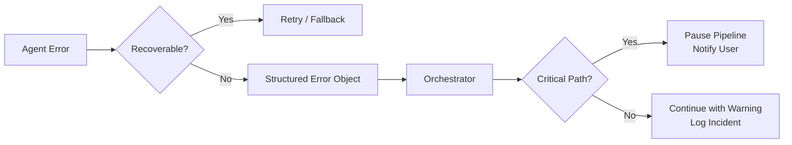

# SKILLS.md — Agent System Contract

> **Version:** 0.1-draft  
> **Status:** Active development  
> **Scope:** 6 specialized agents + 4 cross-cutting skills  

---

## Table of Contents

1. [Agent System Overview](#agent-system-overview)
2. [Data Agent](#1-data-agent)
3. [Analysis Agent](#2-analysis-agent)
4. [Literature Agent](#3-literature-agent)
5. [Visualization Agent](#4-visualization-agent)
6. [Statistics Agent](#5-statistics-agent)
7. [Review Agent](#6-review-agent)
8. [Cross-Cutting Skills](#cross-cutting-skills)
9. [Out of Scope](#out-of-scope)
10. [Error Handling & Failure Modes](#error-handling--failure-modes)

---

## Agent System Overview

Each agent is an autonomous module with a **well-defined contract**: it receives structured input, uses specific tools, produces verifiable output, and declares explicit failure modes. Agents communicate through a shared state object managed by the Orchestrator (LangGraph).

### Shared Conventions

- **Input/Output**: All agent I/O is JSON-serializable and validated against TypeScript Zod schemas before execution.
- **State**: Agents read from and write to a shared `AnalysisState` object. No direct agent-to-agent calls — all routing goes through the Orchestrator.
- **Tools**: Each agent declares a list of tools it can invoke. Tools are stateless functions with typed inputs/outputs.
- **Logging**: Every agent action is logged with `agent_id`, `phase`, `tool_invoked`, `input_hash`, `output_hash`, `duration_ms`, and `status`.
- **Verification**: Each agent includes a `verify()` method that checks output integrity before the Orchestrator passes results downstream.

---

## 1. Data Agent

**Responsibility:** Ingest, validate, and index physics data files (ROOT, EDM4HEP, nanoAOD, Parquet). This is the entry point for all analyses.

### Trigger
- User uploads a ROOT/Parquet file via the dashboard or CLI
- Orchestrator routes a `DATA_INGEST` task with file path(s)
- Scheduled batch ingestion from a configured data directory

### Input

```json
{
  "file_paths": ["/data/cepc/sim/higgs_zz_10k.root"],
  "format": "root_edm4hep | nanoaod | parquet",
  "validation_level": "strict | lenient",
  "metadata": {
    "dataset_name": "Higgs_ZZ_10k",
    "process": "e+e- > HZZ",
    "energy": "240 GeV",
    "generator": "Whizard 2.8.4"
  }
}
```

### Output

```json
{
  "status": "success",
  "dataset_id": "ds_hzz_10k_001",
  "event_count": 10000,
  "branches": ["Electron_pt", "Electron_eta", "Jet_m", "MissingET_met"],
  "schema_hash": "a3f2c8d...",
  "quality_flags": {
    "has_nan": false,
    "has_negative_energy": false,
    "luminosity_consistent": true
  },
  "stored_as": "parquet",
  "storage_path": "/cache/analysis/ds_hzz_10k_001/"
}
```

### Tools

| Tool | Description |
|------|-------------|
| `read_root_file` | Opens ROOT TTree/TNtuple, reads branch metadata and data ranges |
| `validate_schema` | Checks branch types, naming conventions, and required physics objects |
| `convert_to_parquet` | Converts ROOT trees to Apache Parquet for fast columnar access |
| `compute_data_quality` | Calculates event yields, NaN fractions, luminosity cross-checks |
| `register_dataset` | Writes metadata to PostgreSQL via Prisma |

### Failure Modes

| Failure | Detection | Recovery |
|---------|-----------|----------|
| File not found / corrupted | `read_root_file` raises I/O error | Report to user with file path; suggest re-upload |
| Schema mismatch (missing branches) | `validate_schema` fails branch check | Log missing branches; offer partial ingestion in `lenient` mode |
| Out of memory (large files) | Python process OOM or JS heap limit | Switch to chunked reading (100k events/batch); warn user about processing time |
| Duplicate dataset | `register_dataset` finds matching `schema_hash` | Return existing `dataset_id`; skip re-ingestion |

### Verification Criteria
- `event_count > 0`
- `quality_flags.has_nan == false` (in strict mode)
- All declared branches exist in the output `branches` array
- `storage_path` is a valid, readable path
- `dataset_id` is unique and persisted in the database

---

## 2. Analysis Agent

**Responsibility:** Execute physics analysis workflows — cut flows, object selection, feature engineering, and systematic variation studies.

### Trigger
- User submits an analysis request (natural language or structured config)
- Orchestrator routes an `ANALYSIS_RUN` task after Data Agent completes Phase 1
- Literature Agent suggests a methodology change that requires re-analysis

### Input

```json
{
  "dataset_ids": ["ds_hzz_10k_001"],
  "analysis_config": {
    "final_state": "4e (H->ZZ*->4l)",
    "cuts": [
      {"variable": "Electron_pt", "min": 10, "unit": "GeV"},
      {"variable": "Electron_eta", "max": 2.5},
      {"variable": "Z1_mass", "min": 60, "max": 120, "unit": "GeV"},
      {"variable": "Higgs_mass", "min": 110, "max": 160, "unit": "GeV"}
    ],
    "systematics": ["jet_energy_scale", "btag_efficiency", "lepton_id"],
    "output_variables": ["4l_mass", "4l_pt", "Z1_mass", "Z2_mass"]
  },
  "literature_context": {
    "reference_analyses": ["LEP Higgs comb 2003", "ATLAS H->ZZ 2021"],
    "methodology_papers": ["arXiv:2304.xxxxx"]
  }
}
```

### Output

```json
{
  "status": "success",
  "cut_flow": [
    {"step": "All events", "events": 10000, "efficiency": 1.0},
    {"step": "4 electrons, pT > 10 GeV", "events": 3200, "efficiency": 0.32},
    {"step": "Z1 mass window", "events": 1850, "efficiency": 0.185},
    {"step": "Higgs mass window", "events": 420, "efficiency": 0.042}
  ],
  "significance": {
    "s_over_sqrt_b": 12.3,
    "method": "approximate"
  },
  "systematic_summary": {
    "jet_energy_scale": "+3.2% / -2.8% on yield",
    "btag_efficiency": "+1.1% / -1.1% on yield",
    "lepton_id": "+0.9% / -0.9% on yield"
  },
  "output_dataset_id": "ds_hzz_10k_001_selected",
  "plots_generated": ["4l_mass_distribution", "cut_flow_chart"]
}
```

### Tools

| Tool | Description |
|------|-------------|
| `apply_cuts` | Evaluates sequential selection criteria; returns cut-flow table |
| `compute_significance` | Calculates S/√B, expected upper limits, and discovery potential |
| `run_systematic_variation` | Shifts a systematic parameter and re-runs the full cut flow |
| `engineer_features` | Computes derived variables (invariant masses, angular observables) |
| `compare_with_reference` | Compares yields/distributions against a reference analysis from literature |

### Failure Modes

| Failure | Detection | Recovery |
|---------|-----------|----------|
| Zero events after cuts | Cut flow shows 0 surviving events | Warn user; suggest loosening cuts; log the dead-end for optimization |
| Systematic variation fails | `run_systematic_variation` returns NaN or diverges | Fall back to nominal result; flag the systematic for manual review |
| Branch not found in dataset | `apply_cuts` raises key error | Cross-reference with Data Agent schema; report exact missing variable |
| Analysis timeout (>30 min) | BullMQ job timeout | Save partial results; offer to resume from last completed step |

### Verification Criteria
- `cut_flow` has at least 2 steps (initial + at least one cut)
- All efficiency values are between 0 and 1
- `significance` is a finite, positive number
- `systematic_summary` has entries for all requested systematics
- `output_dataset_id` matches a valid entry in the database

---

## 3. Literature Agent

**Responsibility:** Monitor, search, summarize, and cross-reference scientific literature (arXiv, INSPIRE-HEP) in the context of the user's analysis.

### Trigger
- Analysis begins (Phase 1) — automatic literature sweep for the physics channel
- User issues a natural-language query: "What are the latest H→ZZ measurements?"
- Daily scheduled arXiv harvest (cron job)
- Review Agent requests a cross-reference check

### Input

```json
{
  "query_type": "search | monitor | summarize | cross_reference",
  "query": {
    "text": "Higgs to four leptons branching ratio measurement at e+e- colliders",
    "filters": {
      "categories": ["hep-ex", "hep-ph"],
      "date_range": {"from": "2020-01-01", "to": "2026-07-27"},
      "max_results": 20
    }
  },
  "analysis_context": {
    "channel": "H->ZZ*->4l",
    "observables": ["sigma x BR", "mu_HZZ", "coupling_modifier_kappa"]
  }
}
```

### Output

```json
{
  "status": "success",
  "results": [
    {
      "arxiv_id": "2304.12345",
      "title": "CEPC Higgs precision prospects at 240 GeV",
      "authors": ["Zhang, Y.", "Li, X.", "Wang, M."],
      "summary": "Projects ~0.5% precision on H→ZZ* coupling using 5 ab-1 at 240 GeV. Key systematics: ISR/FSR modeling and beam energy spread.",
      "relevance_score": 0.94,
      "key_results": [
        "sigma(HZZ) = 238 +/- 1.2 fb",
        "kappa_Z = 1.002 +/- 0.005"
      ],
      "applicable_systematics": ["ISR_FSR", "beam_energy_spread"]
    }
  ],
  "total_matching": 14,
  "search_vector_index": "papers_hep_20260727"
}
```

### Tools

| Tool | Description |
|------|-------------|
| `search_arxiv` | Queries arXiv API by keyword, author, category, date range |
| `search_inspire` | Queries INSPIRE-HEP for experimental results, citations, and author networks |
| `embed_paper` | Generates vector embeddings of paper text using a domain-adapted model |
| `semantic_search` | Performs similarity search in the vector store using natural-language queries |
| `summarize_paper` | Produces a structured summary (methodology, results, systematics, relevance) |
| `monitor_arxiv` | Scheduled task that harvests new papers and alerts on matches |
| `extract_measurements` | Parses numerical results (cross-sections, couplings, limits) from paper text |

### Failure Modes

| Failure | Detection | Recovery |
|---------|-----------|----------|
| arXiv API rate limit (429) | HTTP 429 response | Exponential backoff (1s, 2s, 4s, 8s); fall back to cached results |
| No matching papers | `results` array is empty | Return a "no matches" response with suggested broader search terms |
| Embedding model timeout | `embed_paper` exceeds 30s | Queue for retry; return non-embedded metadata in the interim |
| Paper PDF parsing failure | `summarize_paper` cannot extract text | Fall back to abstract-only summary; flag for manual review |

### Verification Criteria
- Every result has a valid `arxiv_id` matching the pattern `\d{4}\.\d{4,5}`
- `relevance_score` is between 0 and 1
- `summary` is non-empty and contains at least one physics-specific term
- `key_results` contains at least one numerical value or measurement
- `total_matching` equals the length of the `results` array for `search` queries

---

## 4. Visualization Agent

**Responsibility:** Generate publication-quality physics plots — histograms, contour plots, efficiency maps, and comparison figures.

### Trigger
- Analysis Agent completes a cut flow and requests default plots
- User requests a specific plot: "Show me the 4-lepton mass distribution with signal and background stacking"
- Review Agent identifies a missing figure for the analysis note

### Input

```json
{
  "plot_requests": [
    {
      "type": "stacked_histogram",
      "title": "4-lepton invariant mass distribution",
      "x_axis": {"variable": "4l_mass", "label": "m(4l) [GeV]", "range": [100, 180]},
      "y_axis": {"label": "Events / 2 GeV"},
      "datasets": [
        {"id": "ds_signal", "label": "H->ZZ (signal)", "color": "#e74c3c", "histogram": true},
        {"id": "ds_bkg_zz", "label": "ZZ (bkg)", "color": "#3498db", "histogram": true},
        {"id": "ds_bkg_other", "label": "Other (bkg)", "color": "#95a5a6", "histogram": true}
      ],
      "ratio_panel": {"denominator": "total_bkg", "label": "Data / Bkg"},
      "style": "cepc_collaboration"
    }
  ]
}
```

### Output

```json
{
  "status": "success",
  "plots": [
    {
      "request_id": "plot_001",
      "file_path": "/cache/analysis/plots/4l_mass_distribution.png",
      "file_format": "png",
      "resolution_dpi": 300,
      "interactive_url": "/plots/4l_mass_distribution.html"
    }
  ]
}
```

### Tools

| Tool | Description |
|------|-------------|
| `create_histogram` | Generates 1D/2D histograms with configurable binning, colors, and error bars |
| `create_contour_plot` | 2D exclusion contours in parameter space (e.g., coupling modifier planes) |
| `create_efficiency_map` | Binned efficiency or purity plots as 2D heatmaps |
| `apply_collaboration_style` | Applies CEPC/CERN-approved color palette, font sizes, and layout rules |
| `export_plotly` | Creates interactive HTML version of the plot using Plotly |
| `compare_with_reference` | Overlays published results from literature on the same axes |

### Failure Modes

| Failure | Detection | Recovery |
|---------|-----------|----------|
| Empty dataset for plotting | Histogram has 0 entries in all bins | Return placeholder plot with "No data" annotation; suggest cut loosening |
| Bin range mismatch between datasets | Datasets have incompatible axis ranges | Auto-normalize ranges to the union; warn user about the adjustment |
| Font/Chinese character rendering failure | Matplotlib falls back to tofu boxes | Verify Noto Sans SC font availability; use ASCII labels as fallback |
| Interactive export failure | Plotly HTML generation error | Return static PNG only; log the Plotly version incompatibility |

### Verification Criteria
- `file_path` points to a valid, non-zero-byte image file
- Image dimensions are at least 800x600 pixels (or 300 DPI equivalent)
- For stacked histograms, the sum of stacked bins matches the individual dataset totals
- Ratio panel values are finite and within reasonable bounds (0.5–2.0 for Data/Bkg)
- `interactive_url` returns a 200-status HTML page (if Plotly export succeeded)

---

## 5. Statistics Agent

**Responsibility:** Perform rigorous statistical inference — profile likelihoods, confidence intervals, hypothesis tests, and toy Monte Carlo studies.

### Trigger
- Analysis Agent completes the cut flow and passes yields to the Statistics Agent
- User requests a specific statistical test: "Compute the 95% CL upper limit on mu_HZZ"
- Review Agent flags that a statistical claim lacks proper uncertainty quantification

### Input

```json
{
  "statistical_model": {
    "type": "profile_likelihood",
    "signal_strength_parameter": "mu",
    "channels": [
      {
        "name": "4e_channel",
        "observed": 120,
        "expected_background": 85,
        "background_uncertainty": 8.2,
        "signal_efficiency": 0.042,
        "luminosity_fb": 5.0,
        "cross_section_fb": 238
      }
    ],
    "nuisance_parameters": [
      {"name": "luminosity", "prior": "gaussian(5%)"},
      {"name": "jes", "prior": "gaussian(2%)"},
      {"name": "btag", "prior": "gaussian(1%)"}
    ]
  },
  "toys_config": {
    "n_toys": 10000,
    "seed": 42,
    "cl": 0.95,
    "method": "cls"
  }
}
```

### Output

```json
{
  "status": "success",
  "point_estimate": {
    "mu_hat": 1.03,
    "uncertainty_plus": 0.15,
    "uncertainty_minus": 0.14
  },
  "confidence_interval": {
    "cl": 0.95,
    "method": "cls",
    "lower": 0.75,
    "upper": 1.32
  },
  "expected_limit": {
    "median": 0.08,
    "plus_1sigma": 0.11,
    "minus_1sigma": 0.06,
    "plus_2sigma": 0.15
  },
  "p_value": 0.002,
  "significance_sigma": 3.1,
  "toy_agreement": {
    "ks_test_pvalue": 0.67,
    "converged": true
  },
  "plots": ["likelihood_scan", "nll_vs_mu", "pull_distributions"]
}
```

### Tools

| Tool | Description |
|------|-------------|
| `build_likelihood_model` | Constructs a HistFactory-style likelihood from channel inputs |
| `profile_likelihood_scan` | Scans the NLL as a function of the signal strength parameter |
| `run_toys` | Generates toy Monte Carlo datasets and computes test statistic distributions |
| `compute_cls` | Calculates CLs using the asymptotic formula or toy-based method |
| `compute_bayesian_limit` | Runs MCMC sampling for Bayesian credible intervals (optional) |
| `generate_pull_plots` | Creates pull distributions and correlation matrices for nuisance parameters |

### Failure Modes

| Failure | Detection | Recovery |
|---------|-----------|----------|
| Likelihood does not converge | Minimizer fails to reach tolerance in 1000 iterations | Try alternative minimizers (MINUIT, scipy.optimize); report convergence status |
| Toy MC anomaly (KS test fails) | `toy_agreement.ks_test_pvalue < 0.01` | Increase toy count; check for numerical instabilities; flag for manual review |
| Negative expected background | Background model returns negative yields | Floor at zero with warning; investigate source of negativity |
| Asymptotic approximation invalid | Too few expected events (<5 per bin) | Fall back to toy-based CLs; warn user about the approximation breakdown |

### Verification Criteria
- `point_estimate.mu_hat` is finite and positive
- Confidence interval is valid: `lower < mu_hat < upper`
- `p_value` is between 0 and 1
- `significance_sigma` matches the one-sided Gaussian significance corresponding to `p_value`
- `toy_agreement.converged == true` (or explicitly `false` with documented reason)
- All plot file paths are valid and non-empty

---

## 6. Review Agent

**Responsibility:** Validate analysis results against internal consistency checks, literature benchmarks, and collaboration standards before finalization.

### Trigger
- All 5 preceding agents complete their phases
- User explicitly requests a review: "Check my analysis for issues"
- Automated review triggered as a gate before generating the final analysis note

### Input

```json
{
  "analysis_id": "analysis_hzz_001",
  "results_from_agents": {
    "data": {"dataset_id": "ds_hzz_10k_001", "event_count": 10000},
    "analysis": {"cut_flow": [...], "significance": 12.3},
    "statistics": {"mu_hat": 1.03, "p_value": 0.002},
    "literature": {"matching_papers": 14, "key_references": [...]},
    "visualization": {"plots": 8}
  },
  "review_config": {
    "check_internal_consistency": true,
    "check_literature_agreement": true,
    "check_collaboration_standards": true,
    "generate_analysis_note": true
  }
}
```

### Output

```json
{
  "status": "success",
  "review_checks": [
    {
      "check": "yield_consistency",
      "passed": true,
      "detail": "Cut flow yields are monotonically decreasing and consistent with selection expectations."
    },
    {
      "check": "statistical_validity",
      "passed": true,
      "detail": "Profile likelihood converged. Toy MC agrees with asymptotic approximation (KS p=0.67)."
    },
    {
      "check": "literature_consistency",
      "passed": false,
      "severity": "warning",
      "detail": "Measured mu_HZZ = 1.03 +/- 0.15 differs from CEPC pre-study projection (1.002 +/- 0.005) by ~2 sigma. Check if luminosity or efficiency normalization is correct."
    },
    {
      "check": "systematic_coverage",
      "passed": true,
      "detail": "All 3 requested systematics evaluated. No additional systematics identified from recent literature."
    },
    {
      "check": "plot_standards",
      "passed": true,
      "detail": "All 8 plots meet CEPC collaboration formatting requirements."
    }
  ],
  "overall_verdict": "pass_with_warnings",
  "recommendations": [
    "Verify luminosity normalization against official CEPC MC campaign numbers",
    "Consider adding ISR/FSR systematic (identified in arXiv:2304.12345)"
  ],
  "analysis_note_draft": "/cache/analysis/notes/AN_HZZ_4l_v1.tex"
}
```

### Tools

| Tool | Description |
|------|-------------|
| `check_yield_consistency` | Verifies cut flow is monotonically decreasing; cross-checks with data quality metrics |
| `check_statistical_validity` | Validates convergence, toy agreement, and uncertainty propagation |
| `cross_reference_literature` | Compares results against published measurements using Literature Agent data |
| `check_systematic_coverage` | Ensures all relevant systematics are included; suggests missing ones from papers |
| `validate_plot_standards` | Checks plot dimensions, fonts, colors, labels against collaboration templates |
| `draft_analysis_note` | Generates a LaTeX analysis note template populated with results |

### Failure Modes

| Failure | Detection | Recovery |
|---------|-----------|----------|
| Critical inconsistency found | A review check returns `severity: "error"` | Block analysis finalization; require user acknowledgment before proceeding |
| Literature comparison fails | No matching reference analysis found | Flag as `severity: "info"`; proceed without external validation |
| Analysis note generation fails | LaTeX compilation error or missing template | Return plain-text summary; log the LaTeX error for debugging |

### Verification Criteria
- Every check in `review_checks` has a boolean `passed` field and a non-empty `detail` string
- `overall_verdict` is one of: `pass`, `pass_with_warnings`, `fail`
- `recommendations` is an array (may be empty if all checks pass)
- If `generate_analysis_note == true`, `analysis_note_draft` is a valid file path

---

## Cross-Cutting Skills

These are not standalone agents but **capabilities injected into every agent** via shared middleware.

### 1. Version Control (Git)

- **What it does:** Every agent action that modifies files, code, or configurations automatically commits to git with a structured message: `[{agent_id}] {action}: {description}`
- **Trigger:** Any file write operation by any agent
- **Verification:** `git log` shows a linear history with no uncommitted changes after each pipeline phase
- **Tools:** `git`, `git diff`, `git commit` (via Node.js `simple-git` wrapper)

### 2. Documentation Generation

- **What it does:** Automatically generates and updates documentation (API docs, code comments, analysis logs) as agents produce outputs
- **Trigger:** Agent produces output; middleware hooks into the output event
- **Output:** Markdown files in `/docs/` with auto-generated tables, code examples, and agent action logs
- **Tools:** JSDoc / TSDoc for TypeScript; custom Markdown generator for analysis logs

### 3. Code Quality & Linting

- **What it does:** Enforces consistent code style, type safety, and best practices across all generated and hand-written code
- **Trigger:** Any code generation or modification by an agent
- **Tools:** ESLint, Prettier, TypeScript compiler (`tsc --noEmit`), Ruff (for Python scripts)
- **Verification:** CI pipeline runs full lint + type-check suite; failures block merge

### 4. Configuration & Environment Management

- **What it does:** Manages environment variables, API keys, database connections, and deployment configuration across all agents
- **Trigger:** Agent initialization; environment-dependent operations
- **Tools:** `dotenv`, Prisma schema management, Docker Compose configuration
- **Verification:** `.env.example` stays synchronized with actual `.env` schema; `docker compose config` validates without errors

---

## Out of Scope

The following are explicitly **not** part of the current agent system and will not be implemented in v1.0:

| Excluded Item | Reason |
|---------------|--------|
| **Real-time data acquisition from the detector** | CEPC is still in the design/simulation phase; real DAQ integration is a future concern |
| **Raw detector simulation (Geant4 / DD4hep)** | Computationally prohibitive for an AI copilot; users provide pre-simulated ROOT files |
| **Automatic theory calculation (Feynman diagram computation)** | Requires specialized tools (MadGraph, Whizard) with expert-level configuration |
| **Multi-institutional data sharing / federated analysis** | Political and technical complexity; deferred to v2.0+
| **Non-HEP domains** | The system is purpose-built for particle physics; generalization is explicitly out of scope |
| **Autonomous publication submission** | Human-in-the-loop is required for all external communications and paper submissions |
| **GPU-accelerated inference** | CPU-based inference is sufficient for current scale; GPU optimization is a future performance task |

---

## Error Handling & Failure Modes

### Global Error Policy

1. **Fail loudly, fail structured:** Every agent error produces a structured error object (not an uncaught exception) with `agent_id`, `phase`, `tool`, `error_type`, `message`, and `recoverable` flag.
2. **No silent failures:** If an agent cannot complete its task, the Orchestrator is notified immediately. The user sees a clear, actionable error message.
3. **Graceful degradation:** If a non-critical agent fails (e.g., Literature Agent during an offline analysis), the pipeline continues with a warning rather than halting.
4. **Retry with backoff:** Transient failures (API timeouts, rate limits) trigger exponential backoff retries (max 3 attempts) before escalation.
5. **State checkpointing:** After each phase, the `AnalysisState` is persisted to the database. If the pipeline crashes, it can resume from the last checkpoint.

### Error Propagation Flow



---

*This document serves as the contract between the Orchestrator and all agents. Any modification to agent input/output schemas, tool signatures, or verification criteria requires a version bump and review.*
